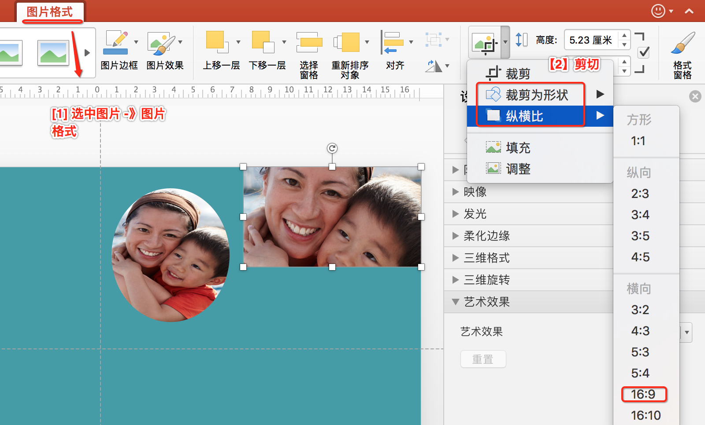
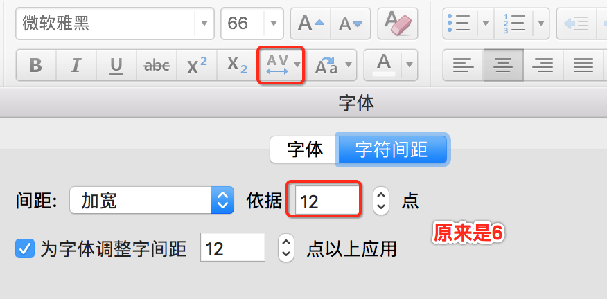

# 6种图片处理技巧

- 剪切：比例剪切和形状剪切
- 色块补充
- 蒙版：直白说就是 **一个半透明的色块**
- 统一颜色：

---

## 剪切

- 比例剪切：通常手机拍摄的图片是4:3，我们可以剪切掉下面一些，弄成16:9的。
- 形状剪切：把图片剪切成三角形，圆形和菱形等。比如团队的照片墙，每个人露个脸，都是圆形的。

如上图所示，选中图片，点击“图片格式” -> “剪裁”图标 -> “裁剪为形状” 或 “纵横比”。

## 色块补充

有时候我们找到一个图片，但是它是4:3的，我们想在16:9的里面平铺。一种方式是剪切掉下边；另一种是等比例缩小后，在右边补一个色块。
色块的颜色通常需要从图片中提取（用``取色器``），以便有更好的融合感。

----

## 蒙版

背景图往往是高清的，有时候会太亮，导致以它作背景时，文字会看不清楚。这时候我们需要淡化背景图片，通常可以做一个半透明的色块来遮罩它，这个遮罩层就叫``蒙版``。

**要点**

1. 设置背景图片：空白右击 -> **“设置背景格式...”** -> "图片或纹理填充" -> "插入图片来自 文件..."。图片素材网站 [pixabay](https://pixabay.com/)
2. 插入矩形形状：用矩形遮住背景图。设置为：无边框、**纯黑色** 填充，透明度25%
3. 显示图层：PPT的图层叫“选择窗格”。位置在“形状格式” -> "选择窗格" （为了能显示“形状格式”，可临时插入一个形状）。显示图层是为了提高编辑效率，可以把暂时不需编辑的地方隐藏起来，以免影响其他的编辑。
4. 标题字间距：为了美观，通常标题的字符间距可以宽松点。
5. 线条：在标题与正文之间加一个细丝线条，美感会提升。
6. 字体：标题字体“微软雅黑”，正文字体“微软雅黑-light”。

**其他截图**

- 字符间距设置

## 统一颜色

背景图往往是高清的，有时候图的主题对了，但是颜色跟我们PPT的主色调不一致。这时候我们需要 **对图片的颜色在PPT内做处理**。

## 简单抠图

平时``抠图``大家都会想到PS工具。其实PPT也是可以抠图的。

>什么是``抠图``：就是把背景色的纯白或纯黑之类的，弄成透明色。例如有张证件照是白底的，我们可以抠图后，弄成蓝底的。

## 艺术效果

比如铅笔素描，``虚化背景``（当背景图片太亮了的时候）
