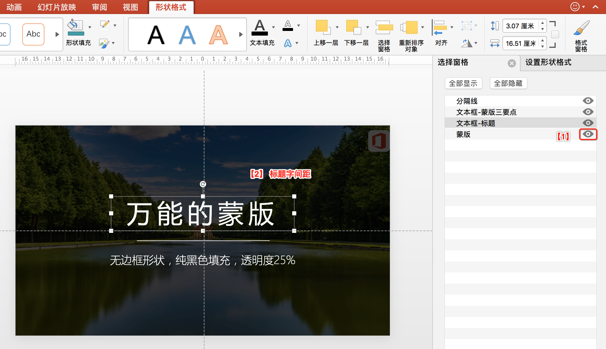

# 蒙版

背景图往往是高清的，有时候会太亮，导致以它作背景时，文字会看不清楚。这时候我们需要淡化背景图片，通常可以做一个半透明的色块来遮罩它，这个遮罩层就叫``蒙版``。

**要点**

1. 设置背景图片：空白右击 -> **“设置背景格式...”** -> "图片或纹理填充" -> "插入图片来自 文件..."。图片素材网站 [pixabay](https://pixabay.com/)
2. 插入矩形形状：用矩形遮住背景图。设置为：无边框、**纯黑色** 填充，透明度25%
3. 显示图层：显示图层：PPT的图层叫“选择窗格”。位置在“图片格式”（不是"形状格式"） -> "选择窗格" （为了能显示“图片格式”，可临时插入一个图片）。显示图层是为了提高编辑效率，可以把暂时不需编辑的地方隐藏起来，以免影响其他的编辑。
4. 标题字间距：为了美观，通常标题的字符间距可以宽松点。
5. 线条：在标题与正文之间加一个细丝线条，美感会提升。
6. 字体：标题字体“微软雅黑”，正文字体“微软雅黑-light”。
