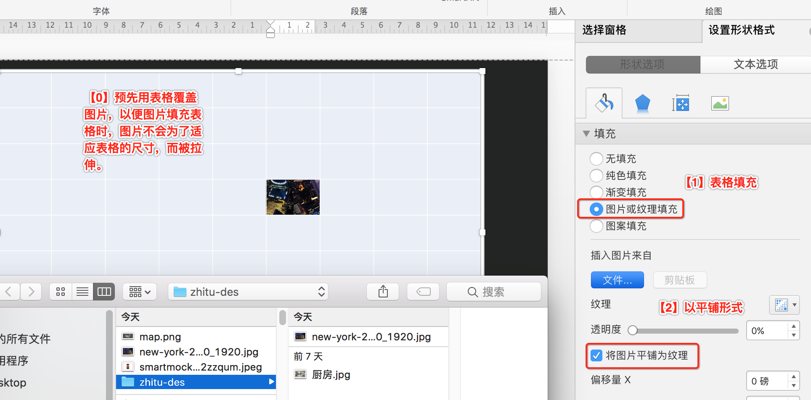

# 表格运用

<!-- TOC depthFrom:1 depthTo:6 withLinks:1 updateOnSave:1 orderedList:0 -->

- [表格运用](#表格运用)
	- [数据呈现](#数据呈现)
		- [练习题](#练习题)
		- [设计点评](#设计点评)
		- [原理讲解](#原理讲解)
	- [表格排版](#表格排版)
		- [练习题](#练习题)
		- [设计点评](#设计点评)
		- [原理讲解](#原理讲解)
	- [表格-拼图](#表格-拼图)
		- [练习题](#练习题)
		- [设计点评](#设计点评)
		- [原理讲解](#原理讲解)

<!-- /TOC -->

## 数据呈现

### 练习题

- 入门级插入表格

- 进阶表格：分组，对比

### 设计点评

- 分组：4个综艺节目。
- 节目间对比：通过``高亮反衬``+``淡化周边``+``立体化``三个手段来突出“我是歌手”（这里是为了更加突出，平时用1~2种对比技法即可）。
- 节目内对比：节目名字和广告费用更加被关注，可以``反衬``，``加粗``，加大字号来突出。
- 符号化：羊角符号代替纯文字。人们对icon之类的更加敏感。羊角符号做了下标-5%处理，同时加大字号，以便符号与文字上下位置相当。
- 去掉标题：去掉标题后，可能不知道语义了。所以在“有/无”广告位则写完文字。
- 文字反衬：强调文字时，加一个色块。圆角矩形+无边框。同时，填充颜色跟头是一样的，做到首尾呼应。
- 字体：``微软雅黑 Light``。

### 原理讲解

- [x] **分组**：表格为什么会看起来跟割裂的一样？
回答：表格去掉外边框，保留``内部竖框线``，同时加宽到6磅，填充色同背景色。另外，其实表格的每一列都可以单独拷贝出来，然后用“对齐+水平分布”也可以做到割裂。

- [x] **立体化**: “我是歌手”为什么会突出出来？并且有立体感？
回答：突出是因为单独复制了一列，适度放大后，盖在上面。立体感是因为给它加了效果（凹凸效果）。

- [x] **凹凸效果**

-----

## 表格排版

### 练习题

### 设计点评

如上图，左边是一个图片（被抠图的），右边是制作流程。制作流程排版非常工整，得益于右边是一个表格。
配色方面有个技巧：字体的红色是取自虾身上的红色。这样融合感更好。

### 原理讲解

原理是跟“数据呈现”章节一样的。

>温馨提醒：``内部竖框线``的线框最宽只有6磅。如果我们需要分离得更开怎么办呢？**中间插入一列**，这列填充色跟背景色一致即可。

----

## 表格-拼图

### 练习题

对一张图实现割裂，拼图效果。

### 设计点评

- 切勿拉伸图片：网格和图片保持独立，不要因为网格拉伸了图片。
- 配色：“不眠的城市”的颜色是灯光的颜色。这样融合感更好。
- 休息：以白底黑字作反衬。

### 原理讲解

**要点**

- 表格填充：平时用纯色填充，还可以用图片填充。填充时，选择“平铺”选项，否则每个格子都是单独的图片。
- 单元格合并和填充：对个别单元格进行合并，并填充其他颜色。
- 防止拉伸：用图片填充表格时，如果尺寸不一致，比如宽高比不一致。填充时，图片会适应表格的宽高比，这样会导致图片被拉伸。为防止拉伸，需要在填充前，把表格设置成图片大小，然后删除图片。
