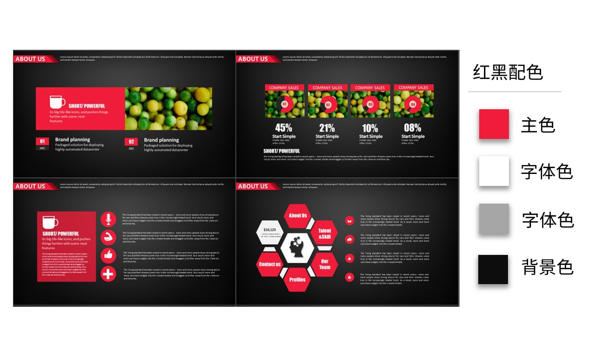
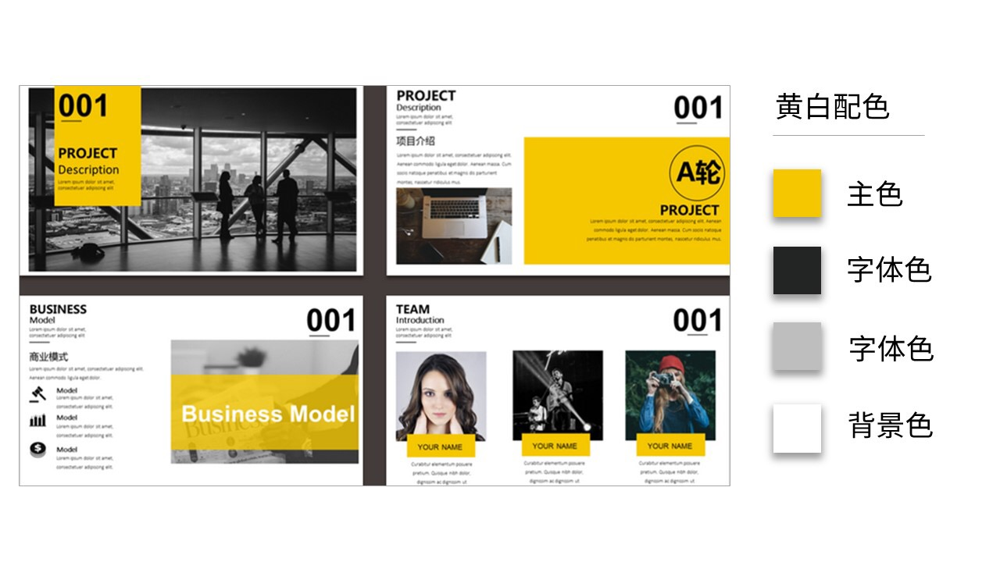
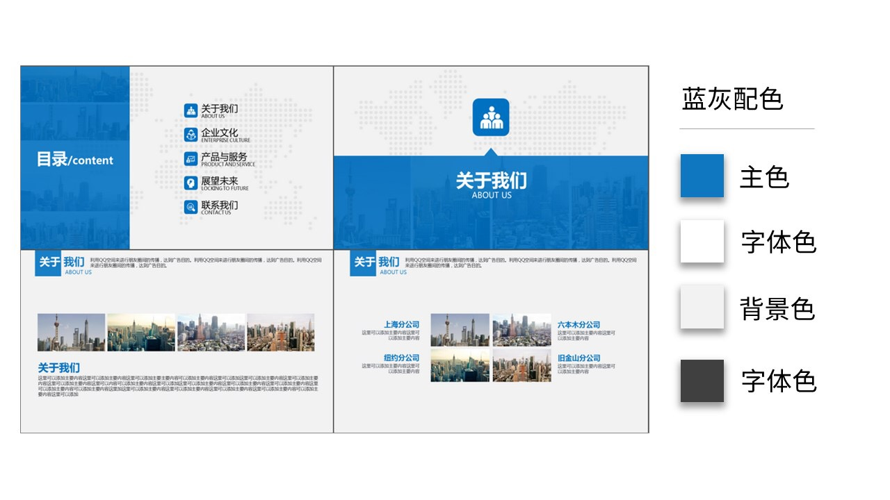
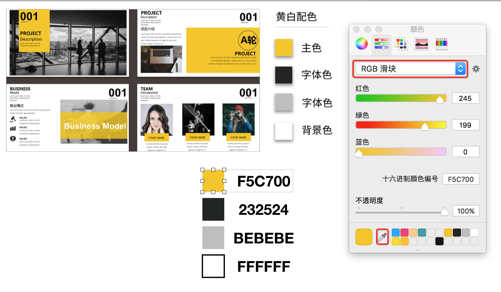
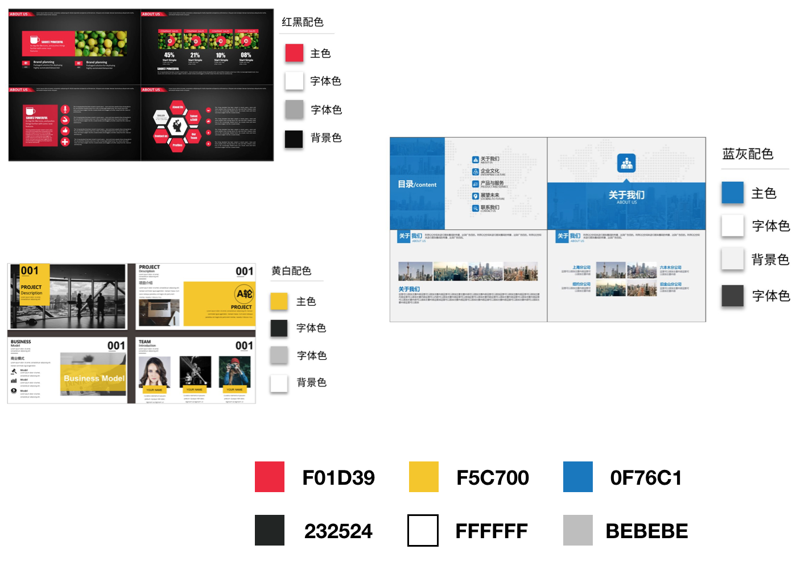
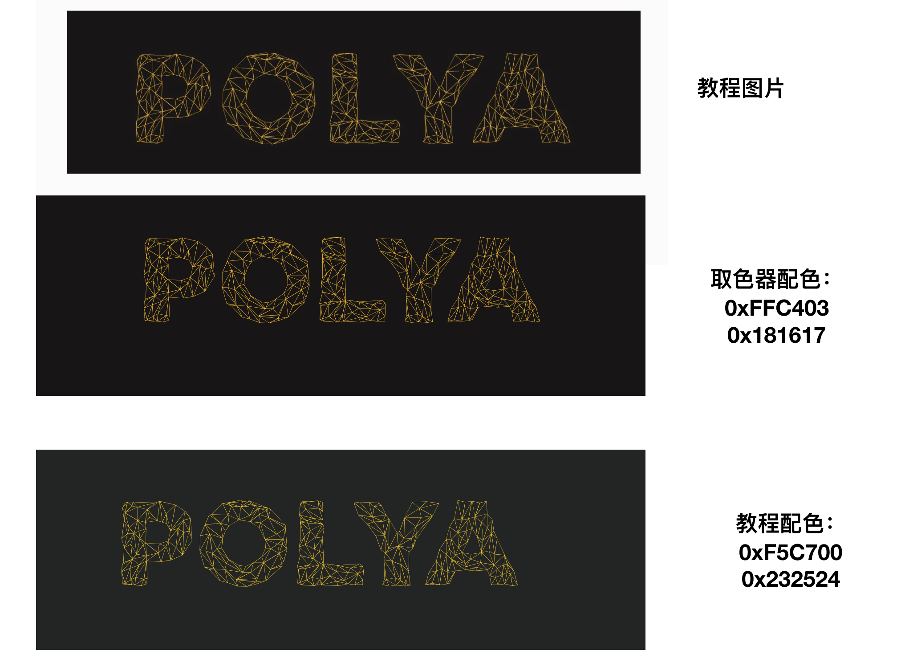
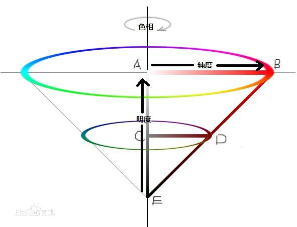
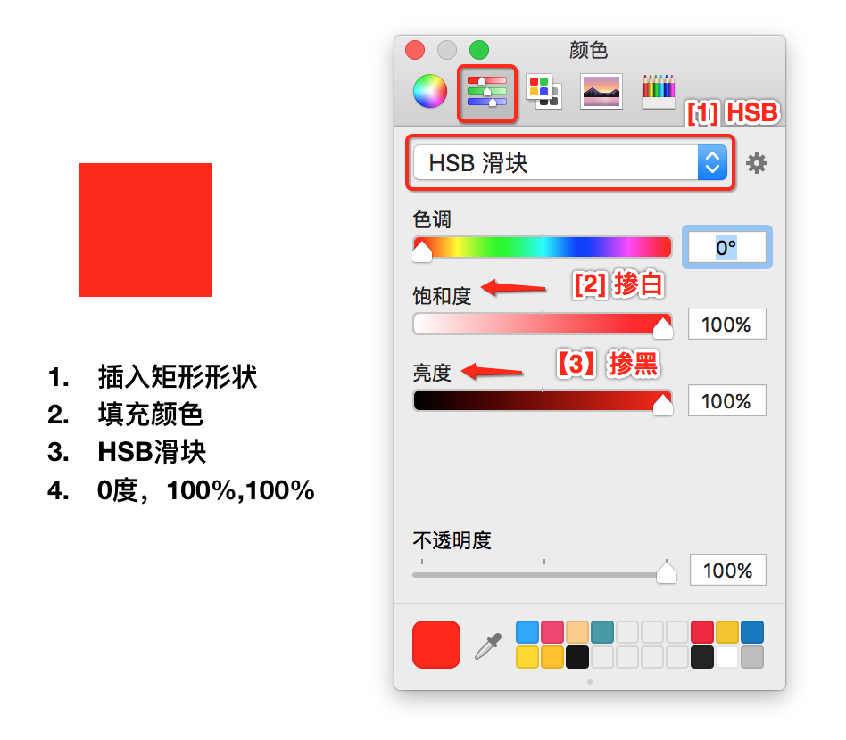

# 配色

## 三款经典配色

- 红黑配色：主色是红，背景是黑

- 黄白配色：主色是黄，背景是白

- 蓝灰配色：主色是蓝，背景是灰

## 配色方案总结

### 主色和辅色

- 主色：红、黄、蓝。主要用于处理色块。
- 辅色：黑、灰、白。主要用户处理背景和字体（分主次）。

| 背景色 | 字体色1 | 字体色2 |
|-----|------|-------|
| 黑  |  灰   |  白   |
| 灰  |  白   |  黑   |
| 白  |  黑   |  灰   |

辅色调配规律：背景色可以是“黑、灰、白”三种选一。当背景色一旦选定后，字体颜色则是剩余两个颜色。

### 精确色值

我们这里的“红黄蓝”和“黑灰白”都不是标准色的“红黄蓝”和“黑灰白”。我们给出精确RGB色值。

| 颜色 | RGB色值（十六机制）|
| ---- | --------------- |
| 红   | 0xF01D39 |
| 黄   | 0xF5C700 |
| 蓝   | 0x0F76C1 |
| 黑   | 0x232524 |
| 灰   | 0xBEBEBE |
| 白   | 0xFFFFFF |

## 实战检验

有一种英文字体叫``Polya``（可以 [免费下载](https://www.behance.net/gallery/20118341/POLYA-Free-Font)，然后双击安装，接着keynote或ppt就会从系统中读取到新安装的polya字体），用这种字体写完字后，我们给配色：背景色用黑色，字体色用黄色。

**注意**
>``polya``字体只支持英文，不支持中文。

-------

# 附录-1：RGB和HSB颜色模式

``HSB色彩模式``是 **基于人眼** 的一种颜色模式。是普及型设计软件中常见的色彩模式，其中H代表色相(Hue)；S代表``饱和度``(saturation)；B代表``亮度``(brightness)。

- 色相H( Hue )：**在0~360°的标准色环上**，按照角度值标识。比如红是0°、橙色是30°等。
- 饱和度S( saturation )：是指颜色的强度或 **纯度**。饱和度表示色相中彩色成分所占的比例，用从0%(灰色)~100%(完全饱和)的百分比来度量。在色立面上饱和度是从内向外逐渐增加。
- 亮度B( brightness )：是颜色的 **明暗程度**，通常是从0(黑)~100%(白)的百分比来度量的，在色立面中从上至下逐渐递减，上边线为100%，下边线为0% 。

**简单理解**
>- ``色相``就表示颜色本身。比如0度是红色，60度是黄色，120度是绿色，180度是蓝色。
>- ``饱和度``就是表示是否往颜料里面勾兑 **白色**。不勾兑，就是100%的纯度。勾兑就是掺白。掺到极致就是白。默认不掺。
>-  ``亮度``就是表示是否往颜料里面勾兑 **黑色**。不勾兑，就是100%的明亮。勾兑了就是掺黑。掺到极致就是黑。默认不掺。

接下来您一定要在PPT里面，用HSB模型自己调试调试，就明白了！！！

