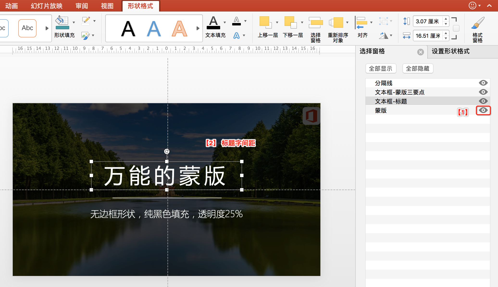

# 备忘速查

## 排版

- 编辑母版："视图" -> "幻灯片母版"。里面除了有母版，还有母版下的11个版式（可以删除，重命名等）。

## 图片处理

- 显示图层：PPT的图层叫“选择窗格”。位置在“图片格式”（不是"形状格式"） -> "选择窗格" （为了能显示“图片格式”，可临时插入一个图片）。

- 抠图：选中图片 -> "图片格式" -> "删除背景"。（红色标注的就是要删除的）
