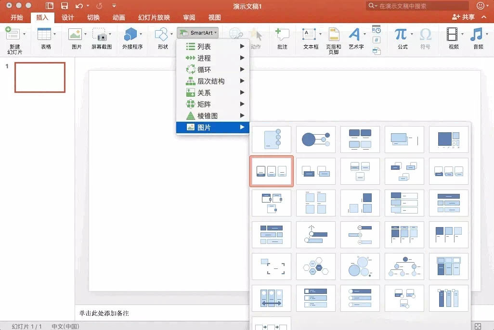
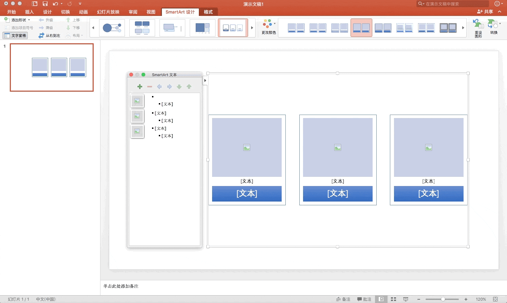
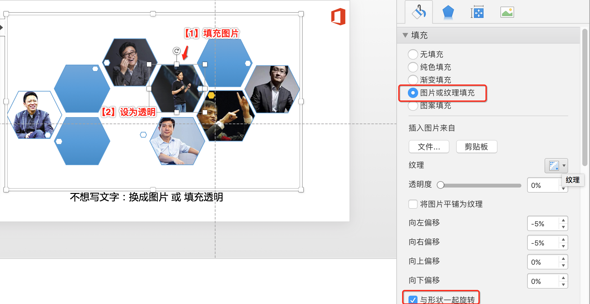
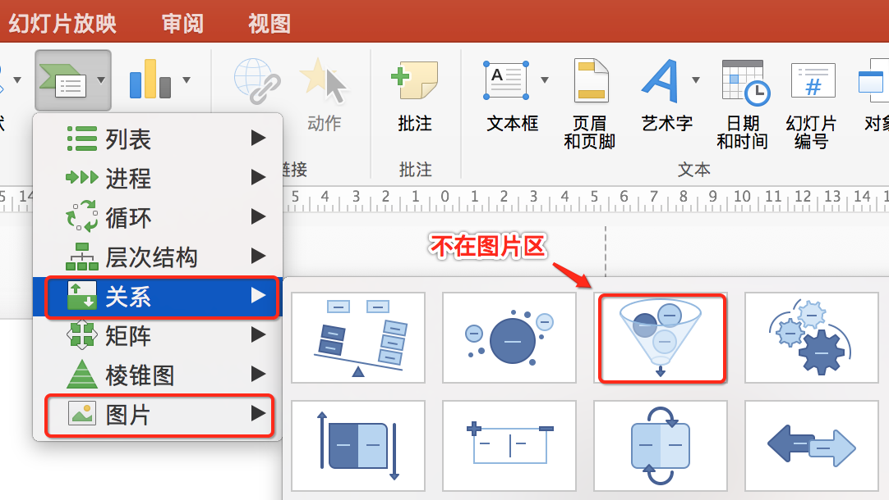
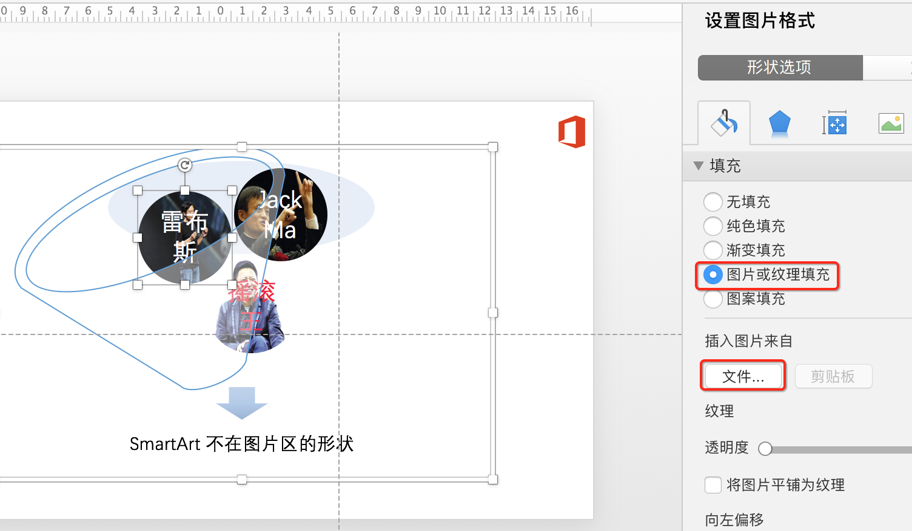

# SamrtArt 与 图片排版

## SmartArt的图片

在 Office 2016 for Mac 上的操作要繁琐一点：

- 插入SmartArt，选择“图片”类别：

- 然后在SmartArt的图片格子里逐个插入图片

## 练习题

### 互联网大佬

>``SmartArt``的图片里面有个小圆点，它们是不能单独去掉的。但是我们可以对它作色，以便从视觉上看不到它们：``无线条``+``100%透明``处理。

### 不写文字

>技巧：上面的``SmartArt``的图片和文字是相伴随的，文字不能去掉。但是如果我们就是不想写文字怎么办？可以手动填充为图片，比如上面的雷军；也可以填充为透明。

### 其他版式

``SmartArt``有很多版式，有些并不在``图片``区，我们能用吗？答：当然可以。只要``填充图片``就可以。

例如：漏斗没有在图片区，但是我们依然可以使用：

使用样例：填充为图片

------

## 推广：基于表格排版

``SmartArt``有形状，可以用于排版。其实表格，也可以用于排版，还可以图文混排。只要在表格的单元格填充图片即可。

- 表格排版：永辉超市的图文混排

- 合并单元格：为了突出某个图，还可以合并单元格以增大位置

**注意**
>用图片填充单元格，特别需要注意的就是``图片宽高比``。图片宽高比要保证和单元格的宽高比一致，否则就会导致图片拉伸变形。所以 **填充前，需要一定的裁剪**。

## 参考资料

- [PPT for Mac 用SmartArt做图片排版](http://www.ifanr.com/app/874869)
- [基于表格的图文混排效果](https://zhuanlan.zhihu.com/p/29526173)
