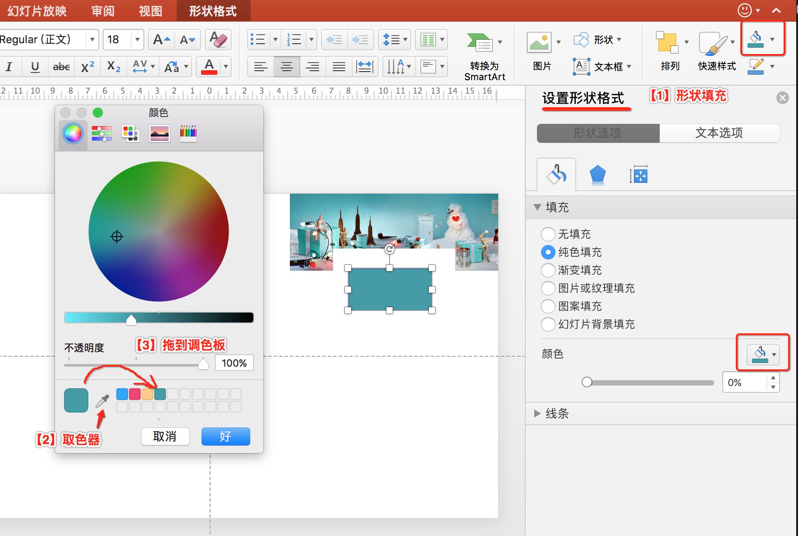

# 取色器

``tiffany``蓝色很好看，如果我们想用，我们怎么调出这个颜色呢？方法一是查询它的``RGB``色号；方法二是去官方找一个图片，然后用``取色器``取图中的颜色，并保存到PPT的调色板中。

用``取色器``的操作步骤：

- 插入``tiffany``图片
- 插入形状：“插入” -> "形状"
- 形状填充：选中形状 -> 设置形状格式 -> 填充 -> 其他颜色填充 -> 取色器
- 保存：取色器取完后，拖放到调色板中，以便日后继续使用

