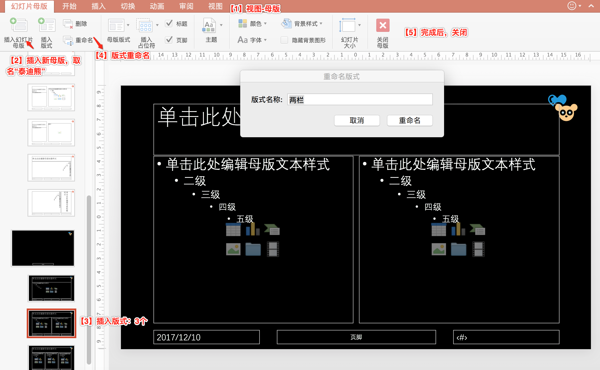
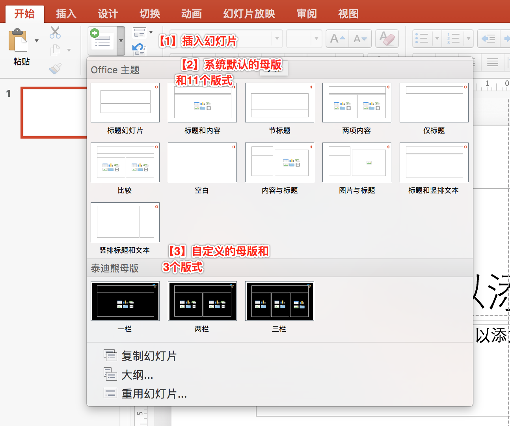

# 幻灯片母版

当我们要给每页的幻灯片加上企业LOGO的时候，很多人都会用``幻灯片母版``。它的位置在“视图” -> “幻灯片母版”。

这里说下两个概念：

- ``母版``：类似面向对象程序设计的超类。“新建幻灯片页”时，基于``母版``，就会自动继承母版内容。按上面LOGO的例子，就不用在每页上再画LOGO了。
- ``版式``: 每个``母版``下可以依据应用场景不同，预先定义若干中``版式``。比如：``标题和正文``，``两栏对比``，``图片与标题``等。

>默认情况下，PPT有：1个母版，名字叫“Office主题”，这个母版下还预设了11个版式，名字叫“标题幻灯片”，“标题和内容”，“两项内容”，“比较”，“空白”等等。

>自定义：母版及其版式都是可以自定义的。一个PPT可以有多个``母版``，每个``母版``下有可以有多个版式。比如笔者演示是自定义了一个叫“泰迪熊”的母版，它下面定义了3个版式，分别是“一栏”，“两栏”和“三栏”。

## 自定义母版及其版式

## 使用自定义母版的版式

---

## 母版可以设置哪些东西？

前面只是讲了有``母版``功能的存在。但是它们具体有哪些功能点，或者说哪些东西可以在母版里面设置，并没有讲到。

----

## 导出母版备以后用

当我们自己设计了一套母版后，我们可以导出，以便以后使用或给其他人使用。位置：文件 ->
