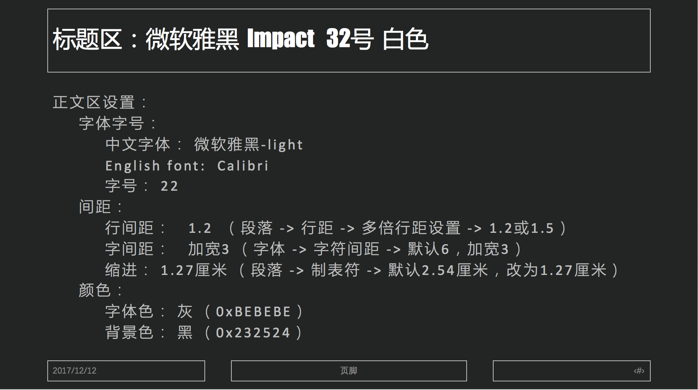
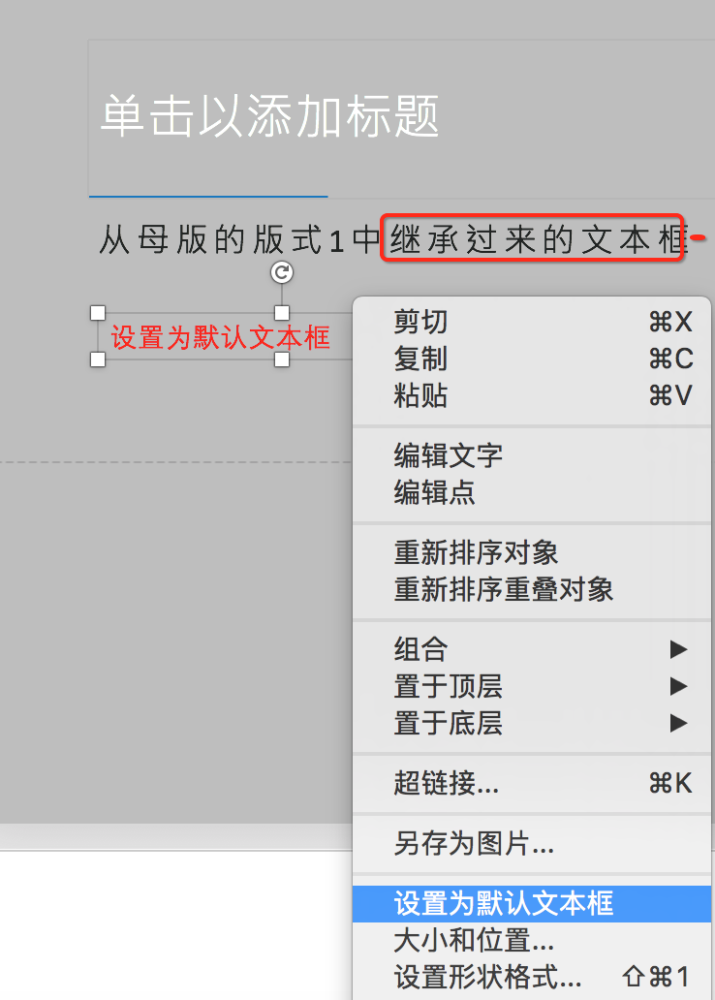

# 母版与字体

## 字体在母版中统一设置




``` yaml
标题区：微软雅黑  Impact   32号  白色

正文区设置：
		字体字号：
    		中文字体： 微软雅黑 Light
    		English font:  Calibri
    		字号： 22
		间距：
    		行间距：   1.2  （段落 -> 行距 -> 多倍行距设置 -> 1.2或1.5）
    		字间距：   加宽3 （字体 -> 字符间距 -> 默认6，加宽3）
    		缩进： 1.27厘米 （段落 -> 制表符 -> 默认2.54厘米，改为1.27厘米）
		颜色：
    		字体色： 灰 （0xBEBEBE）
    		背景色： 黑 （0x232524）
```

-----

# 附录-1：默认文本框的字体，字号，颜色，间距？

## 问题描述

插入文本框时，默认的字体是：宋体、44号、黑色
如何一次性全部修改成：中文用微软雅黑，英文用Impact，字号24号，颜色白色？

## 疑点讲解

我们编辑文本时，文本的样式（包括字体、字号、颜色、字间距、行间距等）往往有 **两种来源**。

- 一种是继承自“母版的版式”中的文本框（注意：可以有很多版式，不同版式里面的文本框的属性，可以设置为不同的样式）；
- 另一种是随页“插入->文本框”时，这个实际上并不继承自版式，而是“设置为默认文本框”。

实际上，对于“形状”、“图片”等的设置，也是一样的。它们的设置也可以是继承自母版中的版式，也可以是“设置为默认形状”等。

实际操作中我们可以定义 **多套字体样式方案**，比如：
- 默认文本框：使用频率最高的字体方案，应该弄到“设置为默认文本框”里面，以便随时都可以插入一个新的文本框。
- 母版版式1：可以增加一个版式，版式中只有1个文本框，并设置好文本框的样式，比如叫“白底黑子左对齐”。用的时候，新建一个PPT页，选择该版式，然后把它copy到其他页。
- 母版版式2：如果我们还有一个“黑底白字居中对齐”的呢？也创建一个版式，只有1个文本框。

当然，有时候，我们没有提前设置后，需要对历史的字体等进行更改。有几种方法：
- 修改母版：如果之前都是继承自母版的，那很简单，只要修改母版就能一次修改，全部的页都生效。
- 替换字体：有的时候，历史的字体是一个个文本框单独设置的，可以``ctrl+F``打开查找替换，然后选择“替换字体”。注意观察：是否是当前页生效还是全部页生效？
- 格式化：先调后一个，然后双击格式刷，再逐个刷。如果牵扯的页太多的话，比较耗时。


## 操作方法

- [ ] “右键→设置为默认”：选中一个文本框，先设置好目标，然后“右键→设置为默认文本框”。
- [ ] 视图 -> 母版 -> 选择某个版式 -> 在版式中编辑文本框，并设置样式


